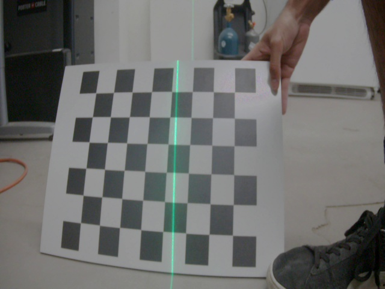

# Light-Stripe-Calibration

- Insert all of your images in the 'images' folder.  
- Change internal parameters of file to fit checkerboard size and dimensions in calibrate.py. Can change color between red or green and orientation.  
- To run: python calibrate.py.  
- Images should contain the laser over a fully visible checkerboard.  

  
Implementation based off:  
Zhou, F., & Zhang, G. (2005). Complete calibration of a structured light stripe vision sensor through planar target of unknown orientations. Image and Vision Computing, 23(1), 59-67.
